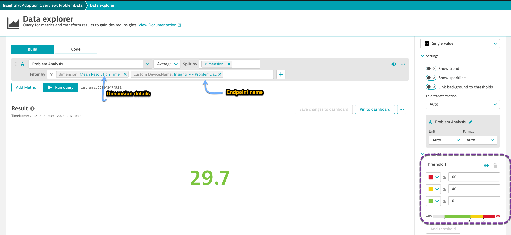
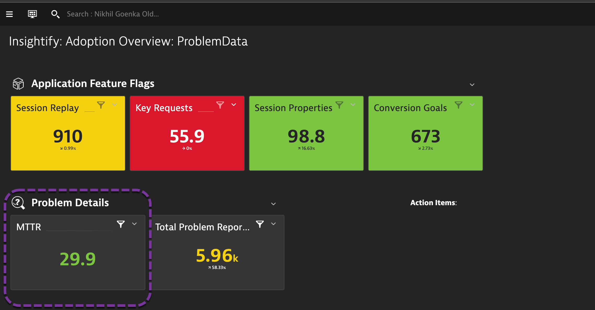
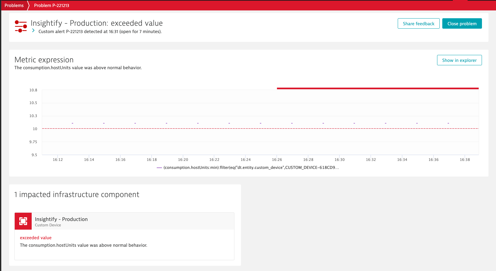
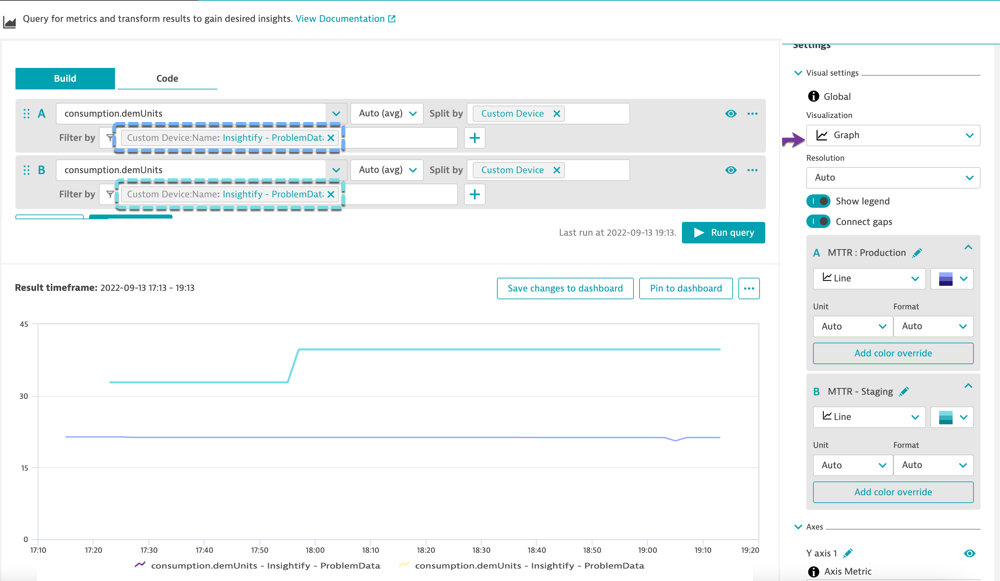
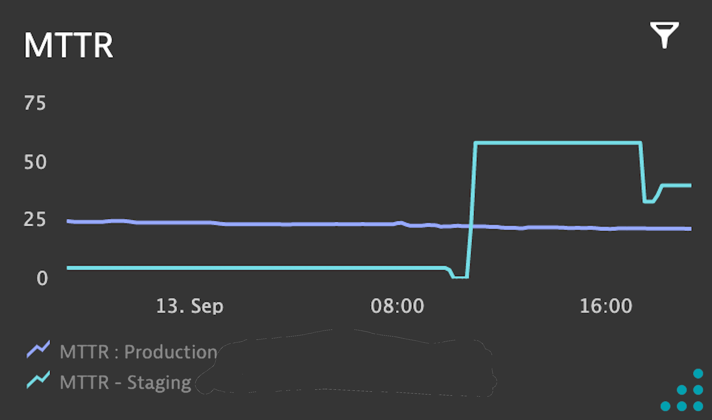

# Other use-cases
Whilst the extension generates the metrics and plot these onto the dashboard, there are some other features that you can leverage by doing additional configuration

## Know your generated metrics  
Extension will create the following metrics (depending on your configuration) that can be leveraged  

    
License Metrics

    | Metric Name                          | Dimensions                           | Generated by configuration              |
    |--------------------------------------|--------------------------------------|-----------------------------------------|
    | Host License Usage                   |     -                                |        Default                          |
    | DEM License Usage                    |     -                                |        Default                          |
    | DDU License Usage                    |     -                                |        Default                          |

    
Feature Flags

    | Metric Name                          | Dimensions                           | Generated by configuration              |
    |--------------------------------------|--------------------------------------|-----------------------------------------|
    | Feature Flag - Tags                  |             -                        |  Capture and report feature adoption data |
    | Feature Flag - Session replay        |             -                        |  Capture and report feature adoption data |
    | Feature Flag - Session Properties    |             -                        |  Capture and report feature adoption data |
    | Feature Flag - Request Attribtues    |             -                        |  Capture and report feature adoption data |
    | Feature Flag - Process Groups        |             -                        |  Capture and report feature adoption data |
    | Feature Flag - Problem Notifications |             -                        |  Capture and report feature adoption data |
    | Feature Flag - Management Zone       |             -                        |  Capture and report feature adoption data |
    | Feature Flag - Key Requests          |             -                        |  Capture and report feature adoption data |
    | Feature Flag - Conversion Goals      |             -                        |  Capture and report feature adoption data |
    | Feature Flag - Alerting Profile      |             -                        |  Capture and report feature adoption data |

    
Problem Analysis
  

    | Metric Name                          | Dimensions                           |      Generated by configuration           |
    |--------------------------------------|--------------------------------------|-------------------------------------------|
    | Problem Analysis                     |        Application Problem           |  Capture and report problem data          |
    | Problem Analysis                     |        Availability Problem          |  Capture and report problem data          |
    | Problem Analysis                     |        Custom Problem                |  Capture and report problem data          |
    | Problem Analysis                     |        Environment Problem           |  Capture and report problem data          |
    | Problem Analysis                     |        Error Problem                 |  Capture and report problem data          |
    | Problem Analysis                     |        Infrastructure Problem        |  Capture and report problem data          |
    | Problem Analysis                     |        Mean Resolution Time          |  Capture and report problem data          |
    | Problem Analysis                     |        Performance Problem           |  Capture and report problem data          |
    | Problem Analysis                     |        Resource Problem              |  Capture and report problem data          |
    | Problem Analysis                     |        Service Problem               |  Capture and report problem data          |
    | Problem Analysis                     |        Total Problems                |  Capture and report problem data          |

    
Incident metrics
  

    | Metric Name                          | Dimensions                            |      Generated by configuration           |
    |--------------------------------------|---------------------------------------|-------------------------------------------|
    | reported_application_problems         |    mgmt_zone,Custom Device           | Capture problem data per management       |
    | reported_availability_problems        |    mgmt_zone,Custom Device           | Capture problem data per management       |
    | reported_custom_problems              |    mgmt_zone,Custom Device           | Capture problem data per management       |
    | reported_error_problems               |    mgmt_zone,Custom Device           | Capture problem data per management       |
    | reported_infra_problems               |    mgmt_zone,Custom Device           | Capture problem data per management       |
    | reported_performance_problems         |    mgmt_zone,Custom Device           | Capture problem data per management       |
    | reported_resource_problems            |    mgmt_zone,Custom Device           | Capture problem data per management       |
    | total_reported_problems               |    mgmt_zone,Custom Device           | Capture problem data per management       |  
    | mttr_rca                              |    mgmt_zone,Custom Device           | Capture problem data per management       |
    | mttr_wo_rca                           |    mgmt_zone,Custom Device           | Capture problem data per management       |

## Create Customized Benefits Valuation/Dashboard Reports  
Using the metrics available within the extension, create **customised dashboards** for showcasing Benefits Relisation. For example, using the problems data I created a dashboard as below that provides quick sneak peak into different aspects of Problems generated, RCA available, MTTR when RCA is available, etc.  
  

## Dashboard Reports

End-user can subscribe to get the dashboard reports weekly or monthly. More details on how to can be found in our help [documentation link](https://www.dynatrace.com/support/help/shortlink/dashboard-reports)  

## Single value trend

Navigate to the `Data Explorer` screen for a specific metric and set expected thresholds for a specific metric. This can be powerful to get a quick view of say **MTTR**, etc.  

## Setting custom alerts

You can setup custom alerts on any of the generated metrics so as to be alerted for any abberations. This could be particularly useful for use-cases wherein you as an end-user would like a specific group to be notified once their consumption goes beyond a threshold. To setup a custom alert, navigate to **Settings > Anomaly Detection >> Custom events for alerting** and set the threshold.  

In the above screenshot, a custom alert is setup for management zone `Cloud:AWS` to be alerted whenever the host consumption in endpoint `Non-prod` breaches 200.  

## Compare consumption or adoption metrics across different endpoints  
You can setup reports to compare adoption data or license data across different endpoints to give an overview how the different tenants are utlizing/adopting Dynatrace. To compare across tenants, navigate to **Data explorer** and split the metric(s) across different endpoints.  
  

This can be further pinned back to the dashboard by clicking on **Pin to Dashboard**.  
  

