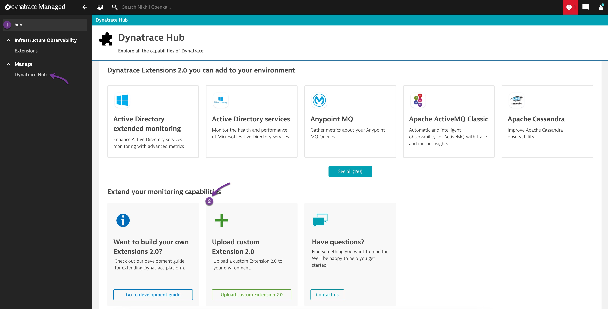

# Guides

## Extension installation and configuration  
1. Find the ca.pem certificate for the extension [here](https://github.com/Dynatrace/insightify/blob/main/src/EF2.0/secrets/ca.pem).  
   1.1 Upload certificate to tenant by following steps as below 🪜
       
       From the navigation menu, select Manage > Credential vault.  
       Select Add new credential.  
       For Credential type, select Public Certificate.  
       Add a meaningful Credential name.  
       Upload the Root certificate file (ca.pem).  
       Select Save.  
       
   1.2 Uploading certificate on ActiveGate(s):  
       Similarly, upload the generated certificate (ca.pem) on all the AGs that you plan to run the extension from. Upload the certificate to location `/var/lib/dynatrace/remotepluginmodule/agent/conf/certificates/` within AG.  

2. Once the certificate has been uploaded, download the extension bundle zip from [here](https://github.com/Dynatrace/insightify/blob/main/releases/EF2.0/1.0/bundle.zip)  
2. Download to get the extension ZIP file. **Don't rename the file.**  
5. Upload the ZIP file on Dynatrace. 
6. Enter the following endpoint information for pulling data:

   - **Configuration name:** A label to identify this connection. It is used for identification purposes.
   - **Tenant URL:** The tenant endpoint from which you want to pull data. Configure it as `https://abc.live.dynatrace.com/api/v1/`, replacing "abc" with the tenant UUID for SaaS. For managed environments, configure it as `https://managed-server/e/environment-endpoint/api/v1/`.
   - **Tenant Token:** The token used to pull data from the configured tenant. Ensure your token has the following scopes:
     - Read problems (API v2)
   - **Publish URL:** The tenant where you'd like to push the pulled metrics. Configure it as `http://xyz.live.dynatrace.com/api/v2/`, replacing "abc" with the tenant UUID for SaaS. For managed environments, configure it as `https://managed-server/e/environment-endpoint/api/v2/`.
   - **Publish Token:** The token used to push metrics. Ensure your token has the following permissions:
     - **Write config (Configuration API v1):** To create a dashboard with the captured metrics.
     - **Read config (Configuration API v1):** Permission to verify if the dashboard is already created.
     - **Ingest Metrics (API v2):** Permissions to push the host units and DEM units into Dynatrace.
     - **Read Metrics (API v2):** Permissions to read the metrics.
     - **Ingest Logs (API v2) (Optional):** Allows pushing the retrieved problem data as logs.

1. Within Dynatrace, navigate to **Settings >> Monitored technologies >> Custom extensions** tab  
   

2. Open `Insightify` and configure it.  
   

#### Configurables

- **Endpoint name:** The name that you want to refer the endpoint with.  
- **Tenant URL:** The tenant URL you would like to fetch data from.  
- **Tenant Token:** Token generated with access to read metrics, access problems, and events. For details on how to generate the token, refer to [this help link](https://www.dynatrace.com/support/help/shortlink/token).  
- **Tenant Config Token:** Token generated with permissions to `ingest metrics, read metrics, ingest logs (optional), and read/write configuration`.   
- **Capture and report problem data per management:** Flag to pull problem data and report it per management zone in a dashboard named `Insightify Incident Report`. The default value is **Yes**.  
- **Push problem details as logs:** Configure to push problem details as logs. If configured, the endpoint will push problem details via the `/ingest/logs` API. By default, this feature is disabled.
- **Duration (in mins) when a problem is treated as an incident:** The time before a problem is considered an incident. Default value is 30 mins.   
- **Capture and Generate Problem Report Data:** Select the time period for generating problem data from options like every 1 day, 30 days, 60 days, 180 days, or annually. The frequency affects data consumption; more frequent pulls provide better insights, while less frequent pulls reduce data points and consumption.  
- **Management Zone Name:** Configure the management zone from which you want to pull data. By default, it pulls data from all management zones.  

3. Once configured, the extension will start successfully. It should display an "OK" status.

> The extension may take a few minutes to initialize on the first run.

### Look around

. Multiple dashboards will be created (depending on your configuration) for each endpoint, offering a quick view of each.  
     
      

## Grail enabled Dashboards  
For Grail dashboards, download the dashboards from [here](https://github.com/Dynatrace/insightify/blob/main/GrailDashboards/1.0/).  
To upload (import) the JSON definition of a dashboard from the Dashboards table  

1. Go to Dashboards. 
2. In the Dashboards panel on the left, select  All dashboards.  
   A Dashboards table displays all dashboards by Name and Last modified date.

3. In the upper-left corner of the page, select  Upload.
4. Find and open the dashboard JSON definition file.

To upload (import) the JSON definition of a dashboard from the Dashboards side panel
In the Dashboards app, in the Dashboards panel on the left, select  Upload.
Open the dashboard JSON definition file you downloaded. Repeat for all the dashboards.  
